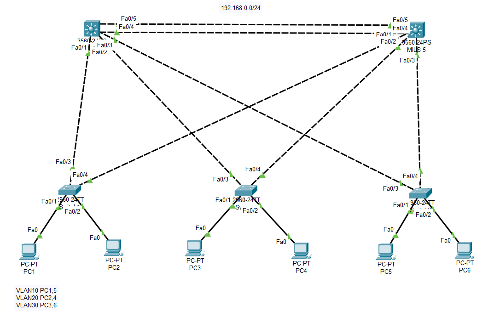
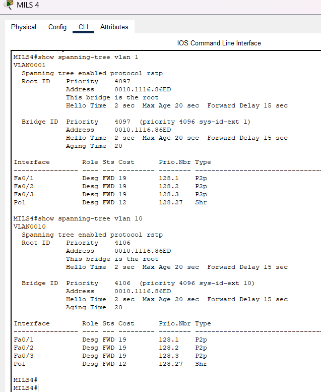
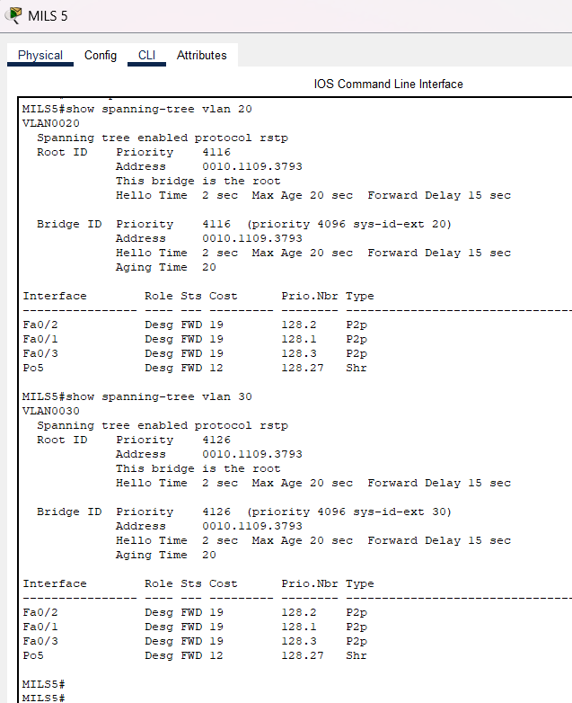
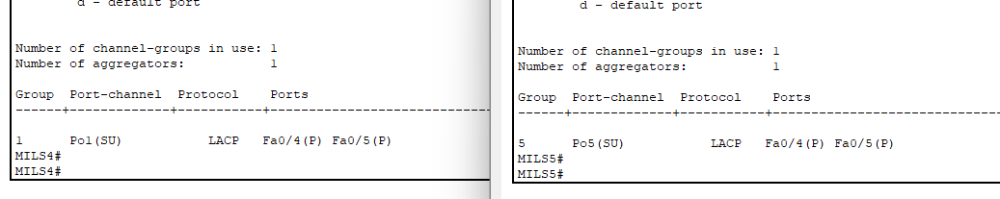

# Lab 01 - VLANs, Trunking, Rapid PVST+, and LACP

## Overview

This lab demonstrates the configuration of VLANs, IEEE 802.1Q trunk links, Rapid PVST+, and LACP EtherChannel using Cisco Packet Tracer.

## Objectives

- Create and assign VLANs.
- Configure Access and Trunk ports.
- Configure Rapid PVST+.
- Control the Root Bridge election by modifying bridge priorities.
- Configure an LACP EtherChannel between the multilayer switches.
- Verify connectivity and Spanning Tree operation.

---

## Topology

---

## Configuration Summary

### VLANs

| VLAN | Devices |
|------|---------|
| VLAN 10 | PC1, PC5 |
| VLAN 20 | PC2, PC4 |
| VLAN 30 | PC3, PC6 |

### Trunk Links

IEEE 802.1Q trunk links were configured between the access switches and the multilayer switches to allow multiple VLANs to traverse the network.

### Rapid PVST+

Rapid PVST+ was configured to provide faster convergence than the legacy STP protocol.

Bridge priorities were manually adjusted to achieve load balancing across VLANs.

MLS4
- Root Bridge for VLAN 1
- Root Bridge for VLAN 10
- Secondary Root for VLAN 20
- Secondary Root for VLAN 30

MLS5
- Root Bridge for VLAN 20
- Root Bridge for VLAN 30
- Secondary Root for VLAN 1
- Secondary Root for VLAN 10

---

## STP Verification

### MLS4 (Root Bridge for VLAN 1 & VLAN 10)

### MLS5 (Root Bridge for VLAN 20 & VLAN 30)

---

## LACP EtherChannel

An LACP EtherChannel was configured between MLS4 and MLS5 by bundling two physical links into a single logical Port-Channel.

### Benefits

- Increased bandwidth
- Link redundancy
- Load balancing

### Verification

---

## Technologies Used

- VLAN
- IEEE 802.1Q Trunking
- Rapid PVST+
- LACP EtherChannel
- Cisco Packet Tracer

---

## Files

- 01_VLANs_Trunking_RPVST_LACP.pkt
